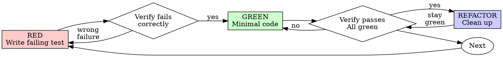

# Copilot Instructions

Respond terse like smart caveman. All technical substance stay. Only fluff die.

Rules:

Drop: articles (a/an/the), filler (just/really/basically), pleasantries, hedging
Fragments OK. Short synonyms. Technical terms exact. Code unchanged.
Pattern: [thing] [action] [reason]. [next step].
Not: "Sure! I'd be happy to help you with that." or "You're absolutely right!" or "Great!"
Yes: "Bug in auth middleware. Fix:"
Switch level: /caveman lite|full|ultra|wenyan Stop: "stop caveman" or "normal mode"

Auto-Clarity: drop caveman for security warnings, irreversible actions, user confused. Resume after.

Boundaries: code/commits/PRs written normal.

## 🚨 Top Priority: Strict Self-Hosting Conversion

**Read [`strict-conversion-plan.md`](../strict-conversion-plan.md) first.** It is the top priority for all ongoing work. The plan outlines converting every C# layer of the Strict implementation into `.strict` files so the language can bootstrap itself. Always check the plan before starting any new task, update progress percentages when `.strict` files are added or C# files are replaced, and follow the layer-by-layer order described there.

## Project Guidelines
- In Strict, type instance equality should check type compatibility and then compare member values (including list/dictionary members) rather than reference equality.
- Aim for a proper root-cause fix rather than a quick workaround or “duct-taping.”
- Apply Limit.cs rules with a ~2x multiplier for C#. Classes should ideally be between 100-400 lines, but classes above 500 lines should be split for better maintainability.
- When splitting `Executor.cs`, keep high-level methods there (Execute, exceptions, DoArgumentsMatch, stackoverflow detection, arguments/instances/parameters handling, RunExpression), and move expression evaluators into separate classes unless they are single-line/simple.
- Do not add new methods to low level types like `SpanExtensions` without asking first; keep refactors focused and fix one issue at a time.
- If you cannot make the test pass within 5 edits, stop and output: failing test name, error message, suspected root cause, and show a proposed fix (or up to 3 fixes if it is unclear). This resets if the user gives a new prompt.
- When a user reports a specific failing reproduction in this repo, trust that exact reproduction and verify that exact case instead of generalizing from broader test runs. When the user already provides an exact failing test that covers the issue, prefer fixing against that existing reproduction instead of adding extra tests.
- When working on this repo, keep fixes narrowly focused on the exact failing reproduction or requested test; if changes start getting out of hand, revert, explain, and let the user take over.
- When debugging in this repo, continue working toward the root cause instead of stopping after a fixed small number of steps.

## Project-Specific Rules
- Strict is a simple-to-understand programming language that not only humans can read and understand, but also computers are able to understand, modify and write it.
- The long-term goal is NOT to create just another programming language, but use Strict as the foundation for a higher level language for computers to understand and write code. This is the first step towards a future where computers can write their own code, which is the ultimate goal of Strict. Again, this is very different from other programming languages that are designed for humans to write code but not for computers to understand it. Even though LLMs can be trained to repeat and imitate, which is amazing to see, they still don't understand anything really and make the most ridiculous mistakes on any project bigger than a handful of files. Strict needs to be very fast, both in execution and writing code (much faster than any existing system), so millions of lines of code can be thought of by computers and be evaluated in real time (seconds).
- Use `dotnet build` to build, `dotnet test` to test, do not try to use VS building or ReSharper build, you always fail trying to do that.
- The AdderProgram implementation must be written in Strict, with C# code only used to run it.
- Keep AdderProgram in the Tests project and use TestPackage (or Strict.Base) for basic types.

## Code Style
- No empty lines are allowed inside methods.
- Always indent with tabs, never use spaces, follow the coding guidelines in .editorconfig and the project's existing style.
- Avoid adding `ArgumentNullException.ThrowIfNull`/debug asserts.
- No duplicate code is allowed, not in production, not in tests. If code exists for something, reuse it. If it doesn't exist, add it in the right place and reuse it.
- Do name variables and members properly, no 1 letter abbreviations (not even i, a, b, c, s, n), explain what this is. i should be index, s could be name or message or whatever, n might be number or name. Do not use long verbose names either. Short scope -> short names, long scope -> longer names with more of an explanation what they are for (e.g. outputFilePath, optimizedInstructions).
- In tests, prefer inlining `var` locals where possible and using expression-bodied tests/helpers when they stay readable; avoid unused helper overloads.
- Do not add more \[Ignore\] attributes in any Tests project, except in an allowlist file.
- Do not add SupportedOSPlatform attributes, especially in tests just because you can't do something locally.
- Do not add ad-hoc hacky cuda kernel code or any code without a proper transpiler or code emitter.
- Do not add long comments, limit to 3 lines for summaries, best is none or 1 line. Inside methods there should usually not be any comments. Do not add comments to separate sections in a file (like using ---- or ====, that's ugly).
- Do not remove TODOs until the code has actually been improved and fixed. When there are tests failing that cover the TODO, the TODO still needs to be tested and fixed before removal.

## Tests
- Do not run Category("Manual") or \[Ignore\] tests ever; tests with these attributes are either supposed to be manually run or are currently disabled and ignored. If a test is fixed, remove the Ignore attribute and it becomes a normal test again.
- Tests in the Slow or Nightly category are usually not run every time and can be skipped and ignored. On bigger refactors they should be run; our CI usually runs them on each check-in as they will be slower and we want to keep all tests fast (<10ms).
- Prefer NCrunch for C# or SCrunch for Strict; all tests should be run all the time (if something changed), it is fine to run tests via `dotnet test` to also include Slow and Nightly tests.
- Do not ignore linker or platform-build errors in code or tests; tests must surface failures instead of swallowing InvalidOperationException for platform compilation issues.
- User prefers minimal test additions in this repo; rely on existing coverage when possible and add at most one focused regression test for a bug fix.
- User prefers not to weaken tests by changing or removing assertions; focus fixes on production code and diagnostics instead.

## Strict Semantics
- When asked about Strict semantics, derive behavior directly from README.md and Strict/TestPackage examples; re-check cited examples before answering and avoid contradicting them.

## Strict.Runtime Guidelines
- Prefer ValueInstance-backed representations and avoid object-based value/rawValue conversions where possible.
- Bytecode artifacts should be self-contained for runtime (no source .strict fallback), and .strictbinary packaging should mirror package/project directory structure for reconstruction.
- Bytecode packaging should be compact and include only actually used methods; base type entries should usually have empty method lists unless methods are called.
- Do not ignore ToolNotFound or toolchain failures during asm/executable creation; throw immediately and do not silently ignore problems.

## Repository Exploration Snapshot of the C# Version of Strict early 2026
- Top-level repository includes core base-library `.strict` type files at root (e.g., `Boolean.strict`, `Number.strict`, `Text.strict`, `List.strict`, `Dictionary.strict`, plus `Any`, `Type`, `Iterator`, `Error`, `Method`, `App`, `System`, `Logger`, `Stacktrace`, `File`, `Directory`, `TextReader`, `TextWriter`, and related foundational types).
- Main solution file is `Strict.sln`, coordinating many projects beyond runtime: `Strict.Bytecode`, `Strict.Compiler`, `Strict.Compiler.Assembly`, `Strict.Compiler.Cuda`, `Strict.Expressions`, `Strict.Grammar`, `Strict.Language`, `Strict.HighLevelRuntime`, `Strict.LanguageServer`, `Strict.Optimizers`, `Strict.PackageManager`, `Strict.TestRunner`, `Strict.Transpiler`, and `Strict.Validators`.
- Primary runtime/interpreter project is `Strict/` targeting .NET 10, with key files `Runner.cs`, `Program.cs`, `VirtualMachine.cs`, `Memory.cs`, `RegisterFile.cs`, and `CallFrame.cs`.
- `Runner.cs` is a central orchestration component (large file) handling source parsing, validation, tests, bytecode generation, optimization, execution, binary save/load, diagnostics, expression execution, and native compilation entry points.
- Runner constructor behavior supports both `.strict` source input and `.strictbinary` precompiled bytecode input.
- Source flow in Runner includes staged execution: parse method bodies/expressions, validate types and constants, execute inline tests, generate bytecode, optimize bytecode, and execute on VM.
- Precompiled flow executes bytecode directly and bypasses source parse/validate/test phases.
- Bytecode optimizer sequence currently includes five named passes: `TestCodeRemover`, `ConstantFoldingOptimizer`, `DeadStoreEliminator`, `UnreachableCodeEliminator`, and `RedundantLoadEliminator`.
- Runner diagnostics can report stage timing and bytecode instruction reduction metrics.
- Runner can emit native binaries by generating NASM x64 assembly and invoking platform toolchain/linker for Windows/Linux/macOS targets.
- Runner argument handling maps CLI numeric args to `Run(numbers)` signatures and supports expression execution patterns like `TypeName(args).Method`.
- `Program.cs` is the CLI entrypoint and supports usage with `.strict` and `.strictbinary` inputs.
- CLI options include diagnostics, decompile mode, and explicit target platform flags (`-Windows`, `-Linux`, `-MacOS`).
- Decompile mode in CLI can turn `.strictbinary` into partial `.strict` output for inspection.
- `Examples/` contains 35+ sample `.strict` programs and also includes `Examples.csproj` plus transpiler-generated C# output under `csTranspilerOutput/`.
- Notable examples include `SimpleCalculator`, `Sum`, `FizzBuzz`, `PureAdder`, and `Fibonacci`, plus additional algorithmic/domain samples (GCD, temperature conversion, linked-list analysis, instruction/processor samples, list and number utilities, etc.).
- Example patterns cover arithmetic, list/range iteration, recursion, mutation via mutable variables, classification logic, and text output behavior.
- `Strict.Tests/` contains focused runtime/integration tests including `RunnerTests`, VM tests, memory/call-frame tests, adder tests, and binary execution performance tests.
- Test stack uses NUnit and includes console output capture/assertion for user-visible behavior validation.
- Test coverage includes bytecode serialization/deserialization workflows (zip-based artifacts) and platform compilation pathways.
- Test project targets .NET 10 and references runtime and bytecode-related projects.
- Performance benchmarking exists in tests (BenchmarkDotNet usage noted in exploration).
- `TestPackage.Instance` is the standard preconfigured package used in tests to preload base types and enable full type resolution/validation.
- Base type behavior highlights: `Boolean` logical ops/conversion, `Number` arithmetic/comparison/iteration/conversions/increment-decrement, `Text` concat/search/conversion helpers, `List` structural ops/indexing/accessors/utilities, `Dictionary` key operations and duplicate-key semantics.
- Architecture implication for future edits: preserve Runner stage boundaries and contracts across parse/validate/test/bytecode/optimize/execute.
- Stability implication for language/runtime changes: keep root base type semantics and example program behavior consistent unless intentionally changed with matching test updates.
- Practical testing implication: prefer extending existing `Strict.Tests` runtime patterns (console assertions, package setup, serialization checks, platform-path checks) when introducing behavior changes.
- Repository context priority: maintain compatibility between source execution and bytecode execution paths, and keep `.strictbinary` behavior self-consistent with runtime expectations.

## Test-Driven Development (TDD)

### Overview

Write the test first. Watch it fail. Write minimal code to pass.

**Core principle:** If you didn't watch the test fail, you don't know if it tests the right thing.

**Violating the letter of the rules is violating the spirit of the rules.**

### When to Use

**Always:**
- New features
- Bug fixes
- Refactoring
- Behavior changes

**Exceptions (ask your human partner):**
- Throwaway prototypes
- Generated code
- Configuration files

Thinking "skip TDD just this once"? Stop. That's rationalization.

### The Iron Law

```
NO PRODUCTION CODE WITHOUT A FAILING TEST FIRST
```

Write code before the test? Delete it. Start over.

**No exceptions:**
- Don't keep it as "reference"
- Don't "adapt" it while writing tests
- Don't look at it
- Delete means delete

Implement fresh from tests. Period.

### Red-Green-Refactor


#### RED - Write Failing Test

Write one minimal test showing what should happen.

<Good>
```typescript
test('retries failed operations 3 times', async () => {
  let attempts = 0;
  const operation = () => {
    attempts++;
    if (attempts < 3) throw new Error('fail');
    return 'success';
  };

  const result = await retryOperation(operation);

  expect(result).toBe('success');
  expect(attempts).toBe(3);
});
```
Clear name, tests real behavior, one thing
</Good>

<Bad>
```typescript
test('retry works', async () => {
  const mock = jest.fn()
    .mockRejectedValueOnce(new Error())
    .mockRejectedValueOnce(new Error())
    .mockResolvedValueOnce('success');
  await retryOperation(mock);
  expect(mock).toHaveBeenCalledTimes(3);
});
```
Vague name, tests mock not code
</Bad>

**Requirements:**
- One behavior
- Clear name
- Real code (no mocks unless unavoidable)

#### Verify RED - Watch It Fail

**MANDATORY. Never skip.**

```bash
npm test path/to/test.test.ts
```

Confirm:
- Test fails (not errors)
- Failure message is expected
- Fails because feature missing (not typos)

**Test passes?** You're testing existing behavior. Fix test.

**Test errors?** Fix error, re-run until it fails correctly.

#### GREEN - Minimal Code

Write simplest code to pass the test.

<Good>
```typescript
async function retryOperation<T>(fn: () => Promise<T>): Promise<T> {
  for (let i = 0; i < 3; i++) {
    try {
      return await fn();
    } catch (e) {
      if (i === 2) throw e;
    }
  }
  throw new Error('unreachable');
}
```
Just enough to pass
</Good>

<Bad>
```typescript
async function retryOperation<T>(
  fn: () => Promise<T>,
  options?: {
    maxRetries?: number;
    backoff?: 'linear' | 'exponential';
    onRetry?: (attempt: number) => void;
  }
): Promise<T> {
  // YAGNI
}
```
Over-engineered
</Bad>

Don't add features, refactor other code, or "improve" beyond the test.

#### Verify GREEN - Watch It Pass

**MANDATORY.**

```bash
npm test path/to/test.test.ts
```

Confirm:
- Test passes
- Other tests still pass
- Output pristine (no errors, warnings)

**Test fails?** Fix code, not test.

**Other tests fail?** Fix now.

#### REFACTOR - Clean Up

After green only:
- Remove duplication
- Improve names
- Extract helpers

Keep tests green. Don't add behavior.

Refactoring can proceed without adding new tests when existing coverage is already green; new tests are only needed for red/green/yellow cycle when adding/changing behavior.

### Repeat

Next failing test for next feature.

## Good Tests

| Quality | Good | Bad |
|---------|------|-----|
| **Minimal** | One thing. "and" in name? Split it. | `test('validates email and domain and whitespace')` |
| **Clear** | Name describes behavior | `test('test1')` |
| **Shows intent** | Demonstrates desired API | Obscures what code should do |

## Why Order Matters

**"I'll write tests after to verify it works"**

Tests written after code pass immediately. Passing immediately proves nothing:
- Might test wrong thing
- Might test implementation, not behavior
- Might miss edge cases you forgot
- "It worked when I tried it" ≠ comprehensive

Test-first forces you to see the test fail, proving it actually tests something.

**"I already manually tested all the edge cases"**

Manual testing is ad-hoc. You think you tested everything but:
- No record of what you tested
- Can't re-run when code changes
- Easy to forget cases under pressure
- "It worked when I tried it" ≠ comprehensive

Automated tests are systematic. They run the same way every time.

**"Deleting X hours of work is wasteful"**

Sunk cost fallacy. The time is already gone. Your choice now:
- Delete and rewrite with TDD (X more hours, high confidence)
- Keep it and add tests after (30 min, low confidence, likely bugs)

The "waste" is keeping code you can't trust. Working code without real tests is technical debt.

**"TDD is dogmatic, being pragmatic means adapting"**

TDD IS pragmatic:
- Finds bugs before commit (faster than debugging after)
- Prevents regressions (tests catch breaks immediately)
- Documents behavior (tests show how to use code)
- Enables refactoring (change freely, tests catch breaks)

"Pragmatic" shortcuts = debugging in production = slower.

**"Tests after achieve the same goals - it's spirit not ritual"**

No. Tests-after answer "What does this do?" Tests-first answer "What should this do?"

Tests-after are biased by your implementation. You test what you built, not what's required. You verify remembered edge cases, not discovered ones.

Tests-first force edge case discovery before implementing. Tests-after verify you remembered everything (you didn't).

30 minutes of tests after ≠ TDD. You get coverage, lose proof tests work.

## Common Rationalizations

| Excuse | Reality |
|--------|---------|
| "Too simple to test" | Simple code breaks. Test takes 30 seconds. |
| "I'll test after" | Tests passing immediately prove nothing. |
| "Tests after achieve same goals" | Tests-after = "what does this do?" Tests-first = "what should this do?" |
| "Already manually tested" | Ad-hoc ≠ systematic. No record, can't re-run. |
| "Deleting X hours is wasteful" | Sunk cost fallacy. Keeping unverified code is technical debt. |
| "Keep as reference, write tests first" | You'll adapt it. That's testing after. Delete means delete. |
| "Need to explore first" | Fine. Throw away exploration, start with TDD. |
| "Test hard = design unclear" | Listen to test. Hard to test = hard to use. |
| "TDD will slow me down" | TDD faster than debugging. Pragmatic = test-first. |
| "Manual test faster" | Manual doesn't prove edge cases. You'll re-test every change. |
| "Existing code has no tests" | You're improving it. Add tests for existing code. |

## Red Flags - STOP and Start Over

- Code before test
- Test after implementation
- Test passes immediately
- Can't explain why test failed
- Tests added "later"
- Rationalizing "just this once"
- "I already manually tested it"
- "Tests after achieve the same purpose"
- "It's about spirit not ritual"
- "Keep as reference" or "adapt existing code"
- "Already spent X hours, deleting is wasteful"
- "TDD is dogmatic, I'm being pragmatic"
- "This is different because..."

**All of these mean: Delete code. Start over with TDD.**

## Example: Bug Fix

**Bug:** Empty email accepted

**RED**test('rejects empty email', async () => {
  const result = await submitForm({ email: '' });
  expect(result.error).toBe('Email required');
});
**Verify RED**$ npm test
FAIL: expected 'Email required', got undefined
**GREEN**
function submitForm(data: FormData) {
  if (!data.email?.trim()) {
    return { error: 'Email required' };
  }
  // ...
}
**Verify GREEN**$ npm test
PASS
**REFACTOR**
Extract validation for multiple fields if needed.

## Verification Checklist

Before marking work complete:

- [ ] Every new function/method has a test
- [ ] Watched each test fail before implementing
- [ ] Each test failed for expected reason (feature missing, not typo)
- [ ] Wrote minimal code to pass each test
- [ ] All tests pass
- [ ] Output pristine (no errors, warnings)
- [ ] Tests use real code (mocks only if unavoidable)
- [ ] Edge cases and errors covered

Can't check all boxes? You skipped TDD. Start over.

## When Stuck

| Problem | Solution |
|---------|----------|
| Don't know how to test | Write wished-for API. Write assertion first. Ask your human partner. |
| Test too complicated | Design too complicated. Simplify interface. |
| Must mock everything | Code too coupled. Use dependency injection. |
| Test setup huge | Extract helpers. Still complex? Simplify design. |

## Debugging Integration

Bug found? Write failing test reproducing it. Follow TDD cycle. Test proves fix and prevents regression.

Never fix bugs without a test.

## Testing Anti-Patterns

When adding mocks or test utilities, read @testing-anti-patterns.md to avoid common pitfalls:
- Testing mock behavior instead of real behavior
- Adding test-only methods to production classes
- Mocking without understanding dependencies

## Final Rule
```
Production code → test exists and failed first
Otherwise → not TDD
```

No exceptions without your human partner's permission.

## Optimization Work
- Demonstrate actual measured improvement in generated executable size and execution speed, not just theoretical flag changes.

## Strict Runtime Conversion Work
- For Strict runtime conversion work, prioritize Text/Path/Directory/File base features first; treat Error as the exception model (no throw/catch work), and defer async/await/Task, HTTP download, reflection, ZIP/binary I/O, and Process.Start to later phases.
- In Strict runtime conversion, Path should not define redundant from/to methods because Path behaves like Text; use Path methods FileName, RemoveExtension, PathOnly returning Path, and move LastIndexOf to Text.strict; implement Text Upper/Lower. 
- Prefer root-cause, general runtime fixes over TestPackage-specific workarounds and reject adding Number.Upper/Lower helper methods for this issue.

## Error Messaging Guidelines
- Ensure error messages are precise and human-readable; avoid unclear wording like 'requested call token'.
- Explicitly distinguish lookup context type from instance value in error messages.
- In this repo, parsing errors must always be derived from `ParsingFailed`.
- Interpreter execution errors in Strict.HighLevelRuntime should use `InterpreterExecutionFailed` with good stack traces and clickable file links instead of raw `VariableNotFound`, `NotSupportedException`, or `InvalidOperationException` (which are all forbidden in this codebase).
- At runtime in VirtualMachine or in a compiled executable `RuntimeError` should be used to display the detailed error with clickable stacktraces going back to the .strict source code!

## Additional Guidelines
- In this repo, keep fixes narrowly focused and avoid adding many new tests; prefer relying on existing coverage and add at most one specific regression test when needed.

## Multithreading Support
- In this repo, treat Repositories and related package-loading/test-running code as intended to support multithreaded execution; caching exists to avoid reloading the same package across parallel tests.
- Keep the `typesToTest` snapshot list in `TestInterpreter.RunAllTestsInPackage` because package types can change while lazily adding generic implementations during execution.
- For this repo's test-runner performance work, parallelize at the package level, not per type; avoid `Parallel.ForEachAsync` over types because type tests are too fine-grained and the overhead dominates.

## Logging Guidelines
- When logging caller chains for diagnostics, include more than just a few methods so the upstream caller beyond framework helpers (like String.Join) is visible.

## VM Optimization Work
- Prefer root-cause VM optimization work that removes string-based frame lookups (FrameKey/CallFrame string access) and stays in ValueInstance/object model lookups instead of adding more caching or tests.
- For the ongoing VM refactor in this repo, remove remaining CallFrame string-lookup issues properly: avoid FrameKey-style fallback behavior, avoid returning fabricated string-based ValueInstances for non-text cases, reduce duplicated Get/TryGet helpers, and focus on lowering the still-high AdjustBrightness allocations.
- For ongoing Strict VM optimization, prioritize root-cause fixes that maximize preallocated register-array use, remove remaining string/dictionary/list hot-loop lookups where possible, and use allocation profiling to target ValueInstance/object allocations before deeper VM changes.

## VM Collection Optimization
- Prefer a single flat preallocated float32 backing for any type composed only of numbers and lists of such types, with fast index-based reads and writes and no per-access object creation in VM or compiled execution.
- Prefer a general flat numeric-list backing for types composed only of numeric members; first implement double-based flattening, then evaluate lower-precision storage later.
