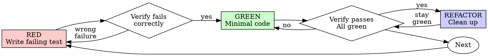

# Copilot Instructions

## 🚨 Top Priority: Strict Self-Hosting Conversion

**Read [`strict-conversion-plan.md`](../strict-conversion-plan.md) first.** It is the top priority
for all ongoing work. The plan outlines converting every C# layer of the Strict implementation into
`.strict` files so the language can bootstrap itself. Always check the plan before starting any new
task, update progress percentages when `.strict` files are added or C# files are replaced, and
follow the layer-by-layer order described there.

## Project Guidelines
- In Strict, type instance equality should check type compatibility and then compare member values (including list/dictionary members) rather than reference equality.
- Aim for a proper root-cause fix rather than a quick workaround or “duct-taping.”
- Apply Limit.cs rules with a ~2x multiplier for C#. Classes should ideally be between 100-400 lines, but classes above 500 lines should be split for better maintainability.
- When splitting `Executor.cs`, keep high-level methods there (Execute, exceptions, DoArgumentsMatch, stackoverflow detection, arguments/instances/parameters handling, RunExpression), and move expression evaluators into separate classes unless they are single-line/simple.
- Do not add new methods to low level types like `SpanExtensions` without asking first; keep refactors focused and fix one issue at a time.
- If you cannot make the test pass within 5 edits, stop and output: failing test name, error message, suspected root cause, and show a proposed fix (or up to 3 fixes if it is unclear). This resets if the user gives a new prompt.

## Project-Specific Rules
- Strict is a simple-to-understand programming language that not only humans can read and understand, but also computers are able to understand, modify and write it.
- The long-term goal is NOT to create just another programming language, but use Strict as the foundation for a higher level language for computers to understand and write code. This is the first step towards a future where computers can write their own code, which is the ultimate goal of Strict. Again, this is very different from other programming languages that are designed for humans to write code but not for computers to understand it. Even though LLMs can be trained to repeat and imitate, which is amazing to see, they still don't understand anything really and make the most ridiculous mistakes on any project bigger than a handful of files. Strict needs to be very fast, both in execution and writing code (much faster than any existing system), so millions of lines of code can be thought of by computers and be evaluated in real time (seconds).
- Use dotnet build to build, dotnet test to test, do not try to use VS building or ReSharper build, you always fail trying to do that.
- The AdderProgram implementation must be written in Strict, with C# code only used to run it.
- Keep AdderProgram in the Tests project and use TestPackage (or Strict.Base) for basic types.

## Code Style
- No empty lines are allowed inside methods.
- Avoid adding `ArgumentNullException.ThrowIfNull`/debug asserts.
- No duplicate code is allowed, not in production, not in tests. If code exists for something, reuse it. If it doesn't exist, add it in the right place and reuse it.
- Do name variables and members properly, no 1 letter abbrevations (not even i, a, b, c, s, n), explain what this is. i should be index, s could be name or message or whatever, n might be number or name. Do not use long verbose names either. Short scope -> short names, long scope -> longer names with more of an explanation what they are for (e.g. outputFilePath, optimizedInstructions).
- In tests, prefer inlining `var` locals where possible and using expression-bodied tests/helpers when they stay readable; avoid unused helper overloads.
- Do not add more \[Ignore\( attributes in any Tests project, except in an allowlist file.
- Do not add SupportedOSPlatform attributes, especially in tests just because you can't do something locally.
- Do not add ad-hoc hacky cuda kernel code or any code without a proper transpiler or code emitter.
- Do not add long comments, limit to 3 lines for summaries, best is none or 1 line. Inside methods there should usually not be any comments. Do not add comments to separate sections in a file (like using ---- or ====, that's ugly).

## Tests
- Do not run Category("Manual") or \[Ignore\] tests ever, tests with these attributes are either supposed to be manually run or are currently disabled and ignored. If a test is fixed, remove the Ignore attribute and it becomes a normal test again.
- Tests in the Slow or Nightly category are usually not run every time and can be skipped and ignored. On bigger refactors they should be run, our CI usually runs them on each checkin as they will be slower and we want to keep all tests fast (<10ms)
- Prefer NCrunch for C# or SCrunch for Strict, all tests should be run all the time (if something changed), it is fine to run tests via `dotnet test` to also include Slow and Nightly tests.

## Strict Semantics
- When asked about Strict semantics, derive behavior directly from README.md and Strict/TestPackage examples; re-check cited examples before answering and avoid contradicting them.

## Strict.Runtime Guidelines
- Prefer ValueInstance-backed representations and avoid object-based value/rawValue conversions where possible.
- Bytecode artifacts should be self-contained for runtime (no source .strict fallback), and .strictbinary packaging should mirror package/project directory structure for reconstruction.
- Bytecode packaging should be compact and include only actually used methods; base type entries should usually have empty method lists unless methods are called.

## Test-Driven Development (TDD)

### Overview

Write the test first. Watch it fail. Write minimal code to pass.

**Core principle:** If you didn't watch the test fail, you don't know if it tests the right thing.

**Violating the letter of the rules is violating the spirit of the rules.**

### When to Use

**Always:**
- New features
- Bug fixes
- Refactoring
- Behavior changes

**Exceptions (ask your human partner):**
- Throwaway prototypes
- Generated code
- Configuration files

Thinking "skip TDD just this once"? Stop. That's rationalization.

### The Iron Law
```
NO PRODUCTION CODE WITHOUT A FAILING TEST FIRST
```

Write code before the test? Delete it. Start over.

**No exceptions:**
- Don't keep it as "reference"
- Don't "adapt" it while writing tests
- Don't look at it
- Delete means delete

Implement fresh from tests. Period.

### Red-Green-Refactor


#### RED - Write Failing Test

Write one minimal test showing what should happen.

<Good>
```typescript
test('retries failed operations 3 times', async () => {
  let attempts = 0;
  const operation = () => {
    attempts++;
    if (attempts < 3) throw new Error('fail');
    return 'success';
  };

  const result = await retryOperation(operation);

  expect(result).toBe('success');
  expect(attempts).toBe(3);
});
```
Clear name, tests real behavior, one thing
</Good>

<Bad>
```typescript
test('retry works', async () => {
  const mock = jest.fn()
    .mockRejectedValueOnce(new Error())
    .mockRejectedValueOnce(new Error())
    .mockResolvedValueOnce('success');
  await retryOperation(mock);
  expect(mock).toHaveBeenCalledTimes(3);
});
```
Vague name, tests mock not code
</Bad>

**Requirements:**
- One behavior
- Clear name
- Real code (no mocks unless unavoidable)

#### Verify RED - Watch It Fail

**MANDATORY. Never skip.**

```bash
npm test path/to/test.test.ts
```

Confirm:
- Test fails (not errors)
- Failure message is expected
- Fails because feature missing (not typos)

**Test passes?** You're testing existing behavior. Fix test.

**Test errors?** Fix error, re-run until it fails correctly.

#### GREEN - Minimal Code

Write simplest code to pass the test.

<Good>
```typescript
async function retryOperation<T>(fn: () => Promise<T>): Promise<T> {
  for (let i = 0; i < 3; i++) {
    try {
      return await fn();
    } catch (e) {
      if (i === 2) throw e;
    }
  }
  throw new Error('unreachable');
}
```
Just enough to pass
</Good>

<Bad>
```typescript
async function retryOperation<T>(
  fn: () => Promise<T>,
  options?: {
    maxRetries?: number;
    backoff?: 'linear' | 'exponential';
    onRetry?: (attempt: number) => void;
  }
): Promise<T> {
  // YAGNI
}
```
Over-engineered
</Bad>

Don't add features, refactor other code, or "improve" beyond the test.

#### Verify GREEN - Watch It Pass

**MANDATORY.**

```bash
npm test path/to/test.test.ts
```

Confirm:
- Test passes
- Other tests still pass
- Output pristine (no errors, warnings)

**Test fails?** Fix code, not test.

**Other tests fail?** Fix now.

#### REFACTOR - Clean Up

After green only:
- Remove duplication
- Improve names
- Extract helpers

Keep tests green. Don't add behavior.

Refactoring can proceed without adding new tests when existing coverage is already green; new tests are only needed for red/green/yellow cycle when adding/changing behavior.

### Repeat

Next failing test for next feature.

## Good Tests

| Quality | Good | Bad |
|---------|------|-----|
| **Minimal** | One thing. "and" in name? Split it. | `test('validates email and domain and whitespace')` |
| **Clear** | Name describes behavior | `test('test1')` |
| **Shows intent** | Demonstrates desired API | Obscures what code should do |

## Why Order Matters

**"I'll write tests after to verify it works"**

Tests written after code pass immediately. Passing immediately proves nothing:
- Might test wrong thing
- Might test implementation, not behavior
- Might miss edge cases you forgot
- "It worked when I tried it" ≠ comprehensive

Test-first forces you to see the test fail, proving it actually tests something.

**"I already manually tested all the edge cases"**

Manual testing is ad-hoc. You think you tested everything but:
- No record of what you tested
- Can't re-run when code changes
- Easy to forget cases under pressure
- "It worked when I tried it" ≠ comprehensive

Automated tests are systematic. They run the same way every time.

**"Deleting X hours of work is wasteful"**

Sunk cost fallacy. The time is already gone. Your choice now:
- Delete and rewrite with TDD (X more hours, high confidence)
- Keep it and add tests after (30 min, low confidence, likely bugs)

The "waste" is keeping code you can't trust. Working code without real tests is technical debt.

**"TDD is dogmatic, being pragmatic means adapting"**

TDD IS pragmatic:
- Finds bugs before commit (faster than debugging after)
- Prevents regressions (tests catch breaks immediately)
- Documents behavior (tests show how to use code)
- Enables refactoring (change freely, tests catch breaks)

"Pragmatic" shortcuts = debugging in production = slower.

**"Tests after achieve the same goals - it's spirit not ritual"**

No. Tests-after answer "What does this do?" Tests-first answer "What should this do?"

Tests-after are biased by your implementation. You test what you built, not what's required. You verify remembered edge cases, not discovered ones.

Tests-first force edge case discovery before implementing. Tests-after verify you remembered everything (you didn't).

30 minutes of tests after ≠ TDD. You get coverage, lose proof tests work.

## Common Rationalizations

| Excuse | Reality |
|--------|---------|
| "Too simple to test" | Simple code breaks. Test takes 30 seconds. |
| "I'll test after" | Tests passing immediately prove nothing. |
| "Tests after achieve same goals" | Tests-after = "what does this do?" Tests-first = "what should this do?" |
| "Already manually tested" | Ad-hoc ≠ systematic. No record, can't re-run. |
| "Deleting X hours is wasteful" | Sunk cost fallacy. Keeping unverified code is technical debt. |
| "Keep as reference, write tests first" | You'll adapt it. That's testing after. Delete means delete. |
| "Need to explore first" | Fine. Throw away exploration, start with TDD. |
| "Test hard = design unclear" | Listen to test. Hard to test = hard to use. |
| "TDD will slow me down" | TDD faster than debugging. Pragmatic = test-first. |
| "Manual test faster" | Manual doesn't prove edge cases. You'll re-test every change. |
| "Existing code has no tests" | You're improving it. Add tests for existing code. |

## Red Flags - STOP and Start Over

- Code before test
- Test after implementation
- Test passes immediately
- Can't explain why test failed
- Tests added "later"
- Rationalizing "just this once"
- "I already manually tested it"
- "Tests after achieve the same purpose"
- "It's about spirit not ritual"
- "Keep as reference" or "adapt existing code"
- "Already spent X hours, deleting is wasteful"
- "TDD is dogmatic, I'm being pragmatic"
- "This is different because..."

**All of these mean: Delete code. Start over with TDD.**

## Example: Bug Fix

**Bug:** Empty email accepted

**RED**
```typescript
test('rejects empty email', async () => {
  const result = await submitForm({ email: '' });
  expect(result.error).toBe('Email required');
});
```

**Verify RED**
```bash
$ npm test
FAIL: expected 'Email required', got undefined
```

**GREEN**
```typescript
function submitForm(data: FormData) {
  if (!data.email?.trim()) {
    return { error: 'Email required' };
  }
  // ...
}
```

**Verify GREEN**
```bash
$ npm test
PASS
```

**REFACTOR**
Extract validation for multiple fields if needed.

## Verification Checklist

Before marking work complete:

- [ ] Every new function/method has a test
- [ ] Watched each test fail before implementing
- [ ] Each test failed for expected reason (feature missing, not typo)
- [ ] Wrote minimal code to pass each test
- [ ] All tests pass
- [ ] Output pristine (no errors, warnings)
- [ ] Tests use real code (mocks only if unavoidable)
- [ ] Edge cases and errors covered

Can't check all boxes? You skipped TDD. Start over.

## When Stuck

| Problem | Solution |
|---------|----------|
| Don't know how to test | Write wished-for API. Write assertion first. Ask your human partner. |
| Test too complicated | Design too complicated. Simplify interface. |
| Must mock everything | Code too coupled. Use dependency injection. |
| Test setup huge | Extract helpers. Still complex? Simplify design. |

## Debugging Integration

Bug found? Write failing test reproducing it. Follow TDD cycle. Test proves fix and prevents regression.

Never fix bugs without a test.

## Testing Anti-Patterns

When adding mocks or test utilities, read @testing-anti-patterns.md to avoid common pitfalls:
- Testing mock behavior instead of real behavior
- Adding test-only methods to production classes
- Mocking without understanding dependencies

## Final Rule
```
Production code → test exists and failed first
Otherwise → not TDD
```

No exceptions without your human partner's permission.
